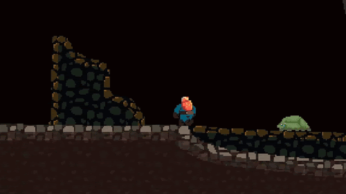

> **Um jogo de plataforma 2D de exploração contínua, apresentando um sistema de terreno totalmente destrutível e carregamento de mundo dinâmico (seamless).**

---

## Sobre o Projeto

Este projeto foi desenvolvido com o objetivo de aprofundar meus conhecimentos em **gerenciamento de memória e otimização de performance** em godot. 

O grande desafio técnico deste jogo foi criar um mundo em que o jogador pudesse alterar em tempo real (destruição de blocos), sem que isso causasse quedas de FPS ou exigisse telas de carregamento. Para resolver isso, implementei uma arquitetura baseada em Chunks.

## Destaques Técnicos

### 1. Sistema de Chunks e *Seamless Loading*
O mundo não é carregado de uma vez só. Ele é dividido em chunks de tamanho fixo. 
* **Carregamento Dinâmico:** Um *Thread* em background calcula a posição do jogador e carrega/instancia apenas os chunks imediatamente próximos a ele.
* **Gerenciamento de Memória:** Chunks que ficam muito distantes do jogador são salvos na memória e descarregados da cena ativa para manter o uso de RAM baixo.

### 2. Terreno Destrutível em Tempo Real
Em vez de usar colisões estáticas pesadas, o terreno é gerenciado de forma otimizada.
* **Manipulação de TileMap:** Uso avançado da API de TileMaps da Godot para atualizar células individuais instantaneamente.
* **Otimização de Colisão:** A quebra de um bloco recalcula a malha de colisão localmente sem travar a *Main Thread*.
* **Persistência de Dados:** O estado de cada chunk alterado (blocos destruídos) é salvo para que, se o jogador voltar ao mesmo local, o buraco cavado ainda esteja lá.

### 3. Física e Movimentação Baseada em Estados (State Machine)
Implementação de um padrão de projeto *Finite State Machine (FSM)* para controlar o jogador. Isso garante que a movimentação seja responsiva, fluida e o código altamente escalável e livre de bugs relacionados a múltiplas ações simultâneas.

---

## Tecnologias e Ferramentas

* **Engine:** Godot Engine 4.5
* **Linguagem:** GDScript
* **Arquitetura/Padrões:** Finite State Machine, Multithreading, Spatial Partitioning.
* **Versionamento:** Git e GitHub.

---
